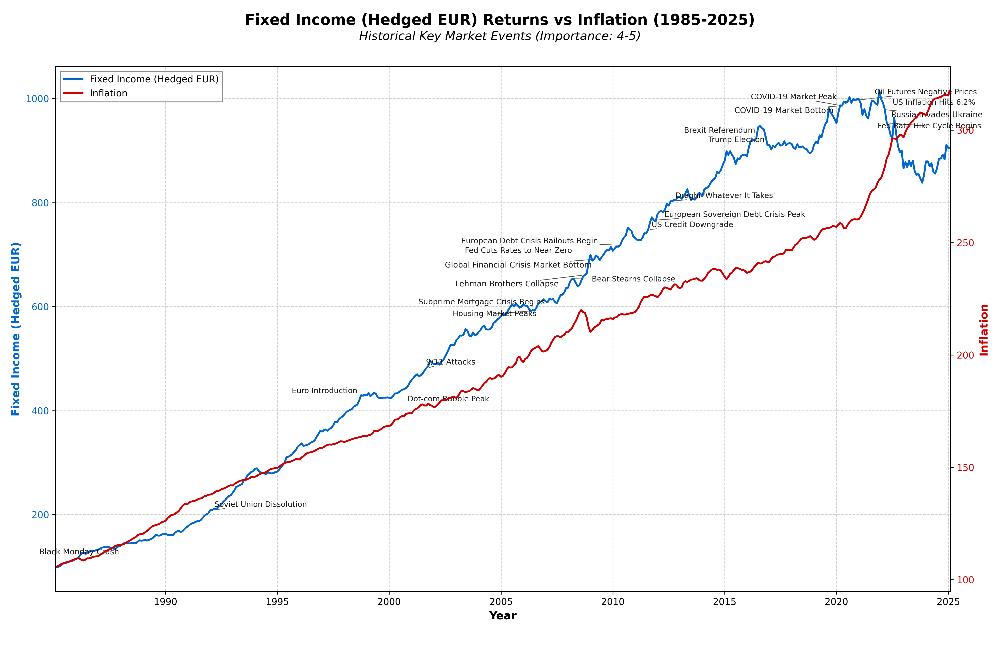
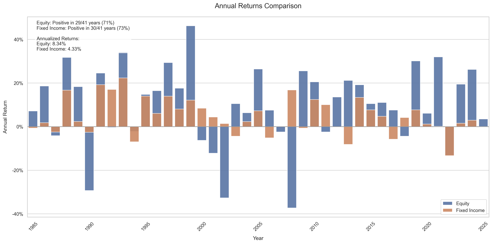
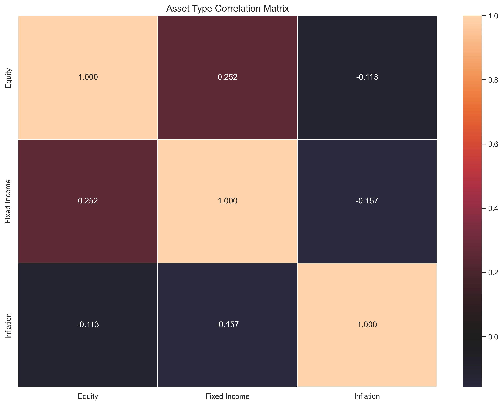
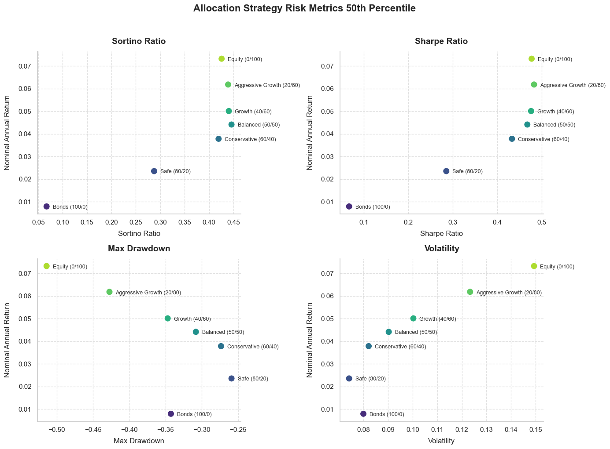

# What 40 Years of Market Data Tell Us About Portfolio Strategies

## Introduction  

Investing in a well-diversified portfolio is a critical decision for long-term financial security. This analysis explores the historical performance of bonds and equities, highlighting their role in different economic conditions. Additionally, a Monte Carlo simulation is used to stress-test various portfolio allocation strategies, capturing a range of potential future outcomes.  

### Bonds as an Inflation Hedge  

Historically, bonds have provided a safeguard against inflation. The first visualization below compares bond returns to U.S. inflation (measured by the Consumer Price Index). While bonds have generally helped preserve purchasing power, the last few years have been exceptionally challenging due to high inflation.  

******  

### Historical Performance of Bonds and Equities (1985–2025)  

The second visualization presents annual returns for bonds and equities from 1985 to 2025. Key statistics from this dataset include:  

- **Equities**: Positive returns in **29 out of 41 years (71%)**  
- **Fixed Income**: Positive returns in **30 out of 41 years (73%)**  
- **Annualized Returns**:  
  - **Equities**: **8.34%**  
  - **Bonds**: **3.33%**  

******  

### Monte Carlo Simulation Overview  

To further stress-test different portfolio strategies, I ran **10,000 Monte Carlo simulations**, capturing a wide range of historical market conditions, including periods of turmoil, bull markets, and bear markets. The visualization below shows a subset of **1,000** simulations due to image size constraints, while performance metrics are based on **100,000 simulations**.  

******  

# Data & Methodology
## Data Sources
The dataset consists of historical market data covering fixed income, equities, inflation, and interest rates:
 - Equities: MSCI World Index (large and mid-cap stocks from 23 developed markets)
 - Fixed Income: FTSE World Government Bond Index (sovereign bonds from 20+ countries)
 - Risk-Free Rate: 3-Month Treasury Bill (TB3MS) from the Federal Reserve
 - Inflation: Consumer Price Index (CPI) from the Bureau of Labor Statistics
 - Federal Funds Rate: Effective interest rate set by the Federal Reserve

These asset classes provide global diversification across both stocks and bonds, modeling realistic investment options for a long-term investor.

## Portfolio Strategies Tested
The analysis includes six portfolio allocations, each with different stock/bond splits:
 - Safe (80% bonds, 20% equities)
 - Conservative (60% bonds, 40% equities)
 - Balanced (50% bonds, 50% equities)
 - Growth (40% bonds, 60% equities)
 - Aggressive Growth (20% bonds, 80% equities)
 - Equity-Only (100% equities)

Portfolios are rebalanced annually to maintain their target allocation.

## Monte Carlo Simulation Assumptions
To test how portfolios perform under uncertainty, I used stochastic modeling with the following parameters:

 - Starting Portfolio Balance: €100
 - Withdrawal Rate: 4% (adjusted annually based on portfolio performance)
 - Simulation Period: 30 years
 - Number of Simulations: 10,000
 - Portfolio Expense Ratio: 0.1%
 - Rebalancing Frequency: Annual
 - Sequence Risk Adjustment: Worst 2-year period first in some scenarios

The Monte Carlo approach allows us to model a range of possible future outcomes, helping investors assess risk, retirement sustainability, and market downturn resilience.

## Observed Correlations and Simulated Growth Rates 

The historical performance of equities and fixed income highlights the fundamental trade-off between risk and return. Equities exhibit the highest **expected annual return** (11.46%) and **CAGR** (10.88%), reflecting their long-term growth potential. However, this comes with greater volatility (**14.66%**), underscoring the inherent market fluctuations. Fixed income assets, while offering lower returns (**4.92% expected annual return**, **4.80% CAGR**), provide stability with significantly lower annual volatility (**6.69%**). 

- **Expected Annual Return**: The arithmetic mean of annual returns, representing the average yearly return without considering compounding.  
- **CAGR (Compound Annual Growth Rate)**: The geometric mean of returns, which accounts for the compounding effect over time, providing a more accurate measure of long-term growth.  

| Asset        | CAGR   | Expected Annual Return   | Annual Volatility   |
|:-------------|:-------|:-------------------------|:--------------------|
| Equity       | 10.88% | 11.46%                   | 14.66%              |
| Fixed Income | 4.80%  | 4.92%                    | 6.69%               |
| Inflation    | 0.25%  | 0.25%                    | 0.09%               |

Inflation, as measured by the Consumer Price Index, has remained relatively stable over time, with minimal annual volatility (**0.09%**). The correlation matrix further emphasizes the diversification benefits of bonds in a portfolio. While equities and fixed income show a **moderate positive correlation (0.252)**, both asset classes exhibit **a slight negative correlation with inflation** (-0.113 for equities, -0.157 for fixed income). This suggests that bonds, despite their relatively low returns, may serve as a hedge against inflationary pressures, though not perfectly. These historical relationships form the foundation for the Monte Carlo simulations used in this study, capturing the potential dynamics of different portfolio allocations under various market conditions.

|      Asset   |   Equity |   Fixed Income |   Inflation |
|:-------------|---------:|---------------:|------------:|
| Equity       |    1     |          0.252 |      -0.113 |
| Fixed Income |    0.252 |          1     |      -0.157 |
| Inflation    |   -0.113 |         -0.157 |       1     |

*** *** 

# Key Findings

## Simulation Summary  

The Monte Carlo simulation highlights the trade-offs between risk and return across different portfolio allocations. More conservative strategies (higher bond allocation) exhibit **lower volatility and smaller drawdowns**, but also deliver **lower long-term returns**. In contrast, equity-heavy portfolios achieve **higher growth** but come with increased **volatility and drawdown risks**.  

| Strategy                  | Nominal End Balance (€)   | Nominal Annual Return (%)   | Volatility (%)   |   Sharpe Ratio |   Sortino Ratio | Max Drawdown (%)   | Perpetual SWR (%)   |
|:--------------------------|:--------------------------|:----------------------------|:-----------------|---------------:|----------------:|:-------------------|:--------------------|
| Bonds (100/0)             | 115.66€                   | 0.80%                       | 8.00%            |      0.0673597 |       0.0670241 | -34.27%            | 0.06%               |
| Safe (80/20)              | 187.61€                   | 2.36%                       | 7.42%            |      0.285773  |       0.287508  | -25.91%            | 1.71%               |
| Conservative (60/40)      | 281.85€                   | 3.79%                       | 8.21%            |      0.433442  |       0.419651  | -27.35%            | 3.25%               |
| Balanced (50/50)          | 332.86€                   | 4.42%                       | 9.03%            |      0.467935  |       0.446126  | -30.82%            | 3.96%               |
| Growth (40/60)            | 386.04€                   | 5.01%                       | 10.03%           |      0.476374  |       0.440628  | -34.71%            | 4.63%               |
| Aggressive Growth (20/80) | 507.24€                   | 6.19%                       | 12.34%           |      0.483023  |       0.439215  | -42.74%            | 5.96%               |
| Equity (0/100)            | 640.18€                   | 7.33%                       | 14.94%           |      0.477635  |       0.425862  | -51.41%            | 7.28%               |

### Key Takeaways:
- **Higher equity allocations** lead to **higher returns**, but also increase **volatility and drawdowns**.
- **Balanced strategies (50/50 or 60/40)** offer a **good mix of stability and growth** with high success rates.
- **Perpetual Safe Withdrawal Rates (SWR)** increase with equity exposure, supporting higher spending over time.

These findings set the stage for a deeper dive into strategy performance, risk-adjusted returns, and the implications for long-term portfolio management.

## Annualized Nominal Returns  

| Strategy                  | Pessimistic Scenario (≤25th Percentile)   | Expected Outcome (25th-75th Percentile)   | Optimistic Scenario (≥75th Percentile)   |
|:--------------------------|:------------------------------------------|:------------------------------------------|:-----------------------------------------|
| Bonds (100/0)             | -9.90% - -1.37%                           | -1.37% - 2.48%                            | 2.48% - 4.61%                            |
| Safe (80/20)              | -3.04% - 0.60%                            | 0.60% - 3.89%                             | 3.89% - 5.82%                            |
| Conservative (60/40)      | -2.05% - 1.93%                            | 1.93% - 5.42%                             | 5.42% - 7.40%                            |
| Balanced (50/50)          | -1.86% - 2.40%                            | 2.40% - 6.12%                             | 6.12% - 8.29%                            |
| Growth (40/60)            | -2.65% - 2.80%                            | 2.80% - 6.82%                             | 6.82% - 9.21%                            |
| Aggressive Growth (20/80) | -5.49% - 3.50%                            | 3.50% - 8.39%                             | 8.39% - 10.96%                           |
| Equity (0/100)            | -14.16% - 4.00%                           | 4.00% - 9.81%                             | 9.81% - 12.86%                           |

### Conclusion:
Portfolios with higher equity allocation exhibit greater growth potential but come with increased downside risk. Conservative strategies mitigate losses but may limit long-term gains.

## Success Rates Over Time  

The success rates of different portfolio strategies remain **exceptionally high** in the early years of the simulation, with all strategies maintaining a **100% success rate** at the 5-year mark. However, as the time horizon extends, **equity-heavy portfolios experience a gradual decline in success rates**, reflecting their higher volatility and risk of drawdowns.  

| Strategy                  | 5      | 10     | 15     | 20     | 25    | 30    |
|:--------------------------|:-------|:-------|:-------|:-------|:------|:------|
| Bonds (100/0)             | 100.0% | 100.0% | 100.0% | 99.9%  | 98.8% | 95.5% |
| Safe (80/20)              | 100.0% | 100.0% | 100.0% | 100.0% | 99.8% | 99.0% |
| Conservative (60/40)      | 100.0% | 100.0% | 100.0% | 100.0% | 99.6% | 98.9% |
| Balanced (50/50)          | 100.0% | 100.0% | 100.0% | 99.9%  | 99.4% | 98.5% |
| Growth (40/60)            | 100.0% | 100.0% | 100.0% | 99.7%  | 98.8% | 97.7% |
| Aggressive Growth (20/80) | 100.0% | 100.0% | 99.7%  | 98.8%  | 97.3% | 95.9% |
| Equity (0/100)            | 100.0% | 100.0% | 99.0%  | 97.2%  | 95.3% | 93.8% |

### Key Takeaways:
- **Short-term success is virtually guaranteed** across all strategies, as even the riskiest portfolios maintain a 100% success rate at 5 years.  
- **Bond-heavy portfolios** remain highly stable over 30 years, with only a **4.5% failure rate** for a **100% bond allocation**.  
- **Equity-heavy portfolios decline more sharply** over time, with a **93.8% success rate at 30 years**, reflecting their **higher volatility and drawdown risk**.  
- **Balanced strategies (50/50, 60/40) provide strong long-term success rates (~98-99%)**, offering a mix of stability and growth.  

These findings reinforce the importance of aligning portfolio risk with investment time horizons, as **higher equity exposure increases long-term uncertainty but also offers greater return potential**.

## Nominal End Balance Ranges

The Monte Carlo simulation reveals significant differences in portfolio outcomes based on asset allocation, highlighting the trade-off between risk and potential growth.

| Strategy                  | Pessimistic Scenario (≤25th Percentile)   | Expected Outcome (25th-75th Percentile)   | Optimistic Scenario (≥75th Percentile)   |
|:--------------------------|:------------------------------------------|:------------------------------------------|:-----------------------------------------|
| Bonds (100/0)             | 2€ - 59€                                  | 59€ - 192€                                | 192€ - 364€                              |
| Safe (80/20)              | 35€ - 109€                                | 109€ - 296€                               | 296€ - 529€                              |
| Conservative (60/40)      | 47€ - 159€                                | 159€ - 460€                               | 460€ - 835€                              |
| Balanced (50/50)          | 47€ - 179€                                | 179€ - 556€                               | 556€ - 1,072€                            |
| Growth (40/60)            | 36€ - 197€                                | 197€ - 670€                               | 670€ - 1,365€                            |
| Aggressive Growth (20/80) | 12€ - 223€                                | 223€ - 989€                               | 989€ - 2,166€                            |
| Equity (0/100)            | 0€ - 231€                                 | 231€ - 1,370€                             | 1,370€ - 3,483€                          |

**Conservative Allocations: Stability at a Cost**
Portfolios with higher bond allocations, such as the 100% bond strategy and the "Safe" (80/20) allocation, demonstrate the lowest nominal ending balances. The 100% bond strategy, in particular, is heavily constrained, with end balances rarely exceeding 364€ in optimistic scenarios. While these portfolios provide stability, their lower upside potential may limit long-term wealth accumulation.

**Balanced Approaches: Strong Mid-Range Performance**
As equity exposure increases, portfolios begin to show greater growth potential. The "Balanced" (50/50) portfolio provides a wider range of outcomes, with a significantly higher ceiling in optimistic scenarios (1,072€) while maintaining a relatively moderate risk in pessimistic cases (47€ minimum). This suggests that balanced portfolios offer a compelling trade-off between stability and long-term growth.

**Growth and Aggressive Strategies: High Risk, High Reward**
Portfolios with greater equity allocations demonstrate the most substantial dispersion in end balance outcomes. The "Aggressive Growth" (20/80) portfolio and the 100% equity strategy show considerable potential, with top-end balances reaching 2,166€ and 3,483€, respectively. However, these strategies also carry higher downside risks, with some scenarios resulting in near-total depletion of assets.

### Key Takeaways: Risk-Return Tradeoffs

The results confirm that increasing equity exposure amplifies both potential rewards and risks. While conservative strategies provide stability, they may struggle to support long-term withdrawals. Balanced and growth-oriented strategies, on the other hand, offer significantly higher potential end balances but require greater risk tolerance. Ultimately, selecting the right allocation depends on individual risk appetite, investment horizon, and withdrawal needs.

## Perpetual Safe Withdrawal Rate (SWR) with 0.5% Safety Margin

The simulation results show that **SWR varies significantly by asset allocation**, with conservative portfolios struggling to sustain long-term withdrawals and equity-heavy strategies offering higher sustainable rates.

| Strategy                  | Pessimistic Scenario (≤25th Percentile)   | Expected Outcome (25th-75th Percentile)   | Optimistic Scenario (≥75th Percentile)   |
|:--------------------------|:------------------------------------------|:------------------------------------------|:-----------------------------------------|
| Bonds (100/0)             | 0.0% - 0.0%                               | 0.0% - 1.8%                               | 1.8% - 4.0%                              |
| Safe (80/20)              | 0.0% - 0.0%                               | 0.0% - 3.3%                               | 3.3% - 5.4%                              |
| Conservative (60/40)      | 0.0% - 1.3%                               | 1.3% - 5.0%                               | 5.0% - 7.1%                              |
| Balanced (50/50)          | 0.0% - 1.9%                               | 1.9% - 5.7%                               | 5.7% - 8.0%                              |
| Growth (40/60)            | 0.0% - 2.3%                               | 2.3% - 6.5%                               | 6.5% - 9.0%                              |
| Aggressive Growth (20/80) | 0.0% - 3.2%                               | 3.2% - 8.2%                               | 8.2% - 10.9%                             |
| Equity (0/100)            | 0.0% - 3.9%                               | 3.9% - 9.8%                               | 9.8% - 13.0%                             |

**Conservative Allocations: Low Withdrawal Capacity**
- 100% Bonds: Cannot sustain perpetual withdrawals in most cases (0.0% SWR in pessimistic scenarios).
- Safe (80/20): Marginally better, but still unable to sustain long-term withdrawals in worst-case scenarios-

 **Balanced Strategies: Improved Sustainability**
 - Balanced (50/50): Expected SWR ranges from 1.9% to 5.7%, providing a mix of stability and reasonable withdrawal potential.
 - Conservative (60/40): Similar performance, with a slightly lower ceiling.

**Growth Strategies: Higher Long-Term Withdrawals**
- Aggressive Growth (20/80): Expected SWR ranges from 3.2% to 8.2%, with an optimistic potential of 10.9%.
- 100% Equity: Highest withdrawal capacity, reaching 13.0% in the most favorable scenarios, though also the most volatile.

### Key Takeaways:
 - Bond-heavy portfolios struggle to sustain long-term withdrawals, often failing in adverse conditions.
 - Balanced portfolios (50/50, 60/40) provide moderate withdrawal capacity, making them a reasonable compromise.
 - Growth and equity-heavy strategies allow for higher withdrawals but come with greater volatility and risk.

These findings highlight the importance of balancing withdrawal needs with risk tolerance, as higher equity exposure increases long-term sustainability but comes with more uncertainty.

## Maximum Drawdown Analysis

The Monte Carlo simulation reveals significant differences in drawdown risk across portfolio strategies, emphasizing the trade-offs between stability and return potential.

| Strategy                  | Pessimistic Scenario (≤25th Percentile)   | Expected Outcome (25th-75th Percentile)   | Optimistic Scenario (≥75th Percentile)   |
|:--------------------------|:------------------------------------------|:------------------------------------------|:-----------------------------------------|
| Bonds (100/0)             | -97.6% - -53.2%                           | -53.2% - -24.6%                           | -24.6% - -16.5%                          |
| Safe (80/20)              | -68.2% - -36.0%                           | -36.0% - -19.8%                           | -19.8% - -14.5%                          |
| Conservative (60/40)      | -63.1% - -36.4%                           | -36.4% - -22.3%                           | -22.3% - -16.1%                          |
| Balanced (50/50)          | -64.7% - -40.4%                           | -40.4% - -25.2%                           | -25.2% - -18.6%                          |
| Growth (40/60)            | -72.6% - -45.1%                           | -45.1% - -28.8%                           | -28.8% - -22.1%                          |
| Aggressive Growth (20/80) | -90.0% - -54.3%                           | -54.3% - -36.2%                           | -36.2% - -27.6%                          |
| Equity (0/100)            | -100.0% - -63.6%                          | -63.6% - -44.1%                           | -44.1% - -33.1%                          |

**Conservative Allocations: Lower Volatility, Less Severe Drawdowns**
 - 100% Bonds: Can still experience severe declines (up to -97.6% in worst cases), but median drawdowns are more limited.
 - Safe (80/20): Reduces drawdown risk substantially compared to pure bonds, with maximum expected losses around -36.0%.

**Balanced Strategies: Moderate Drawdowns**
- Balanced (50/50): Drawdowns are more pronounced (up to -40.4% median loss) but still manageable for long-term investors.
- Conservative (60/40): Similar profile, with slightly lower volatility.

**Growth Strategies: Increased Volatility, Deeper Drawdowns**
 - Aggressive Growth (20/80): Expected drawdowns reach -54.3% in median cases, with worst-case losses as deep as -90%.
 - 100% Equity: The most extreme drawdowns (up to -100% in worst cases), reflecting the inherent risk of equity-heavy strategies.

   ### Key Takeaways
- Bond-heavy portfolios still experience severe drawdowns, despite their lower volatility.
- Balanced strategies (50/50, 60/40) offer more stability, reducing the risk of catastrophic losses while maintaining growth potential.
- Equity-heavy portfolios face the highest drawdowns, requiring a strong risk tolerance to endure market downturns.

These findings highlight the importance of diversification and risk management, especially for investors relying on portfolio withdrawals.

### Risk-Adjusted Performance

**Sharpe & Sortino Ratios**
 - Aggressive Growth (20/80) strategy exhibits the highest risk-adjusted return, achieving the best Sharpe ratio (0.483) and a strong Sortino ratio (0.439).
 - Balanced and growth-oriented strategies (40/60, 50/50, 60/40) provide a solid middle ground, offering competitive Sharpe and Sortino ratios while balancing return potential and downside risk.
 - The Equity-heavy (0/100) portfolio no longer holds the top position, as its Sharpe and Sortino ratios are slightly lower than some more diversified approaches.
 - Conservative and bond-heavy strategies (80/20, 100/0) exhibit significantly lower risk-adjusted returns, reflecting their limited upside potential despite lower volatility.

| Strategy                  |   Sharpe Ratio (50th Percentile) |   Sortino Ratio (50th Percentile) |
|:--------------------------|---------------------------------:|----------------------------------:|
| Bonds (100/0)             |                        0.0673597 |                         0.0670241 |
| Safe (80/20)              |                        0.285773  |                         0.287508  |
| Conservative (60/40)      |                        0.433442  |                         0.419651  |
| Balanced (50/50)          |                        0.467935  |                     **0.446126**  |
| Growth (40/60)            |                        0.476374  |                         0.440628  |
| Aggressive Growth (20/80) |                    **0.483023**  |                         0.439215  |
| Equity (0/100)            |                        0.477635  |                         0.425862  |

### Volatility & Max Drawdown
 - **100% Bonds:** Lowest volatility but still experiences significant drawdowns in extreme scenarios.
 - **Balanced strategies (50/50, 60/40):** Offer moderate drawdowns while maintaining reasonable upside potential.
 - **100% Equity:** Highest volatility and deepest drawdowns, but also the highest growth potential.

The risk-return trade-off is evident across different portfolio allocations. Equity-heavy strategies provide higher expected returns but at the cost of increased volatility, while conservative allocations offer stability with limited upside.

 

### nominal balance by year (50th percentile)

| Strategy                  | 5    | 10   | 15   | 20   | 25   | 30   |
|:--------------------------|:-----|:-----|:-----|:-----|:-----|:-----|
| Bonds (100/0)             | 101€ | 102€ | 103€ | 105€ | 107€ | 112€ |
| Safe (80/20)              | 106€ | 114€ | 124€ | 137€ | 153€ | 176€ |
| Conservative (60/40)      | 112€ | 128€ | 150€ | 177€ | 213€ | 265€ |
| Balanced (50/50)          | 116€ | 136€ | 163€ | 198€ | 246€ | 316€ |
| Growth (40/60)            | 119€ | 142€ | 173€ | 218€ | 281€ | 370€ |
| Aggressive Growth (20/80) | 126€ | 156€ | 200€ | 263€ | 358€ | 500€ |
| Equity (0/100)            | 133€ | 168€ | 225€ | 313€ | 450€ | 655€ |

| Strategy                  | 5    | 10   | 15   | 20   | 25   | 30   |
|:--------------------------|:-----|:-----|:-----|:-----|:-----|:-----|
| Bonds (100/0)             | 102€ | 104€ | 107€ | 110€ | 113€ | 121€ |
| Safe (80/20)              | 107€ | 117€ | 128€ | 143€ | 162€ | 188€ |
| Conservative (60/40)      | 113€ | 131€ | 155€ | 185€ | 226€ | 284€ |
| Balanced (50/50)          | 118€ | 139€ | 169€ | 208€ | 261€ | 338€ |
| Growth (40/60)            | 120€ | 145€ | 179€ | 228€ | 298€ | 396€ |
| Aggressive Growth (20/80) | 127€ | 160€ | 206€ | 276€ | 379€ | 535€ |
| Equity (0/100)            | 135€ | 172€ | 234€ | 327€ | 478€ | 703€ |

