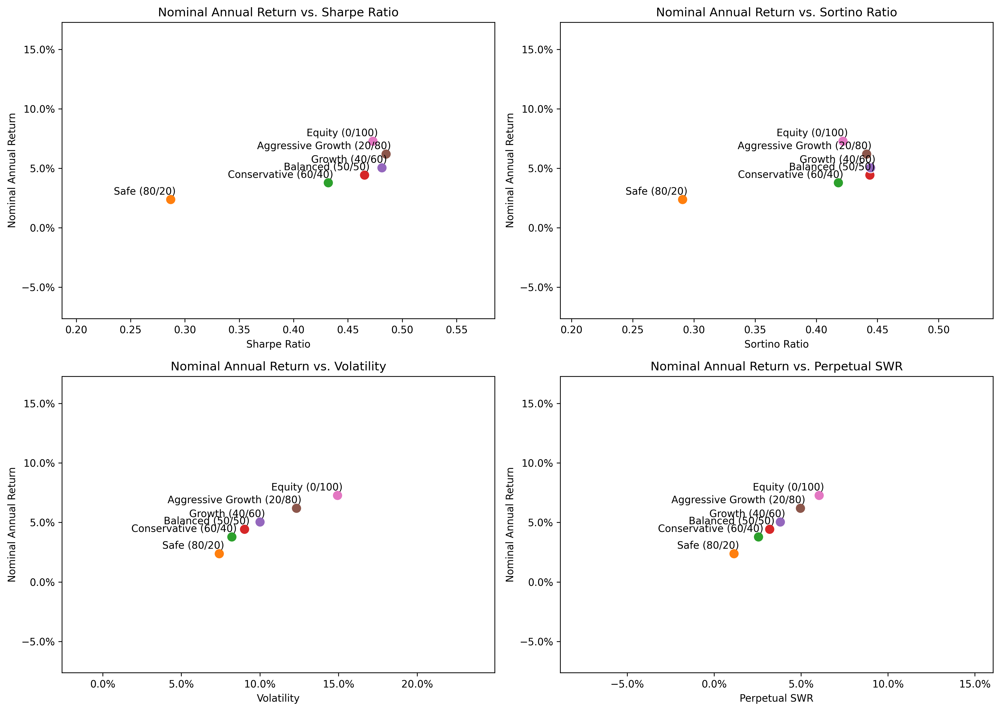

# monte-carlo-portfolio-analysis
A comprehensive analysis of portfolio performance and survival based on different asset allocations, using historical data and Monte Carlo simulations. This project explores the relationship between fixed income, equity, inflation, and interest rates, evaluating various financial metrics to compare investment strategies.

THe table below is 50th percentile stats

ARE INFLATION ADJUSTMENTS BEING APPLIED CORRECTLY?

| Strategy                  | Nominal End Balance   | Nominal Annual Return   | Volatility   |   Sharpe Ratio |   Sortino Ratio | Max Drawdown   | Perpetual SWR   |
|:--------------------------|:----------------------|:------------------------|:-------------|---------------:|----------------:|:---------------|:----------------|
| Safe (80/20)              | €187.72               | 2.37%                   | 7.42%        |       0.286934 |        0.290792 | -25.81%        | 1.14%           |
| Conservative (60/40)      | €280.92               | 3.78%                   | 8.22%        |       0.431945 |        0.418081 | -27.64%        | 2.55%           |
| Balanced (50/50)          | €333.58               | 4.42%                   | 9.03%        |       0.465318 |        0.443823 | -30.76%        | 3.19%           |
| Growth (40/60)            | €389.40               | 5.04%                   | 10.01%       |       0.481327 |        0.444398 | -34.40%        | 3.81%           |
| Aggressive Growth (20/80) | €509.29               | 6.19%                   | 12.33%       |       0.485123 |        0.441193 | -42.78%        | 4.96%           |
| Equity (0/100)            | €630.36               | 7.27%                   | 14.94%       |       0.47302  |        0.421841 | -51.09%        | 6.04%           |

Nominal End Balance Range

| Strategy                  | Pessimistic Scenario (< 25th Percentile)   | Expected Outcome (25th-75th Percentile)   | Optimistic Scenario (> 75th Percentile)   |
|:--------------------------|:-------------------------------------------|:------------------------------------------|:------------------------------------------|
| Safe (80/20)              | < €110.65                                  | €110.65 - €294.93                         | > €294.93                                 |
| Conservative (60/40)      | < €158.97                                  | €158.97 - €454.04                         | > €454.04                                 |
| Balanced (50/50)          | < €179.31                                  | €179.31 - €558.45                         | > €558.45                                 |
| Growth (40/60)            | < €198.74                                  | €198.74 - €682.64                         | > €682.64                                 |
| Aggressive Growth (20/80) | < €221.94                                  | €221.94 - €993.52                         | > €993.52                                 |
| Equity (0/100)            | < €228.60                                  | €228.60 - €1,384.59                       | > €1,384.59                               |

Perpetual Withdrwal Rate (are these figures inlation adjusted in percentile stats?)

| Strategy                  | Pessimistic Scenario (< 25th Percentile)   | Expected Outcome (25th-75th Percentile)   | Optimistic Scenario (> 75th Percentile)   |
|:--------------------------|:-------------------------------------------|:------------------------------------------|:------------------------------------------|
| Safe (80/20)              | ≤ 0.00%                                    | 0.00% - 2.64% (50th percentile: 1.14%     | > 2.64% (95th percentile: 4.56%)          |
| Conservative (60/40)      | ≤ 0.67%                                    | 0.67% - 4.15% (50th percentile: 2.55%     | > 4.15% (95th percentile: 6.16%)          |
| Balanced (50/50)          | ≤ 1.15%                                    | 1.15% - 4.90% (50th percentile: 3.19%     | > 4.90% (95th percentile: 7.03%)          |
| Growth (40/60)            | ≤ 1.59%                                    | 1.59% - 5.66% (50th percentile: 3.81%     | > 5.66% (95th percentile: 7.95%)          |
| Aggressive Growth (20/80) | ≤ 2.24%                                    | 2.24% - 7.16% (50th percentile: 4.96%     | > 7.16% (95th percentile: 9.80%)          |
| Equity (0/100)            | ≤ 2.74%                                    | 2.74% - 8.61% (50th percentile: 6.04%     | > 8.61% (95th percentile: 11.72%)         |
