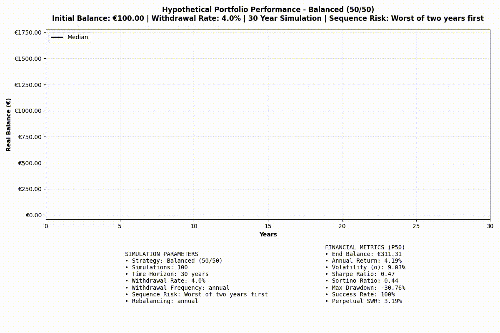

# What 40 Years of Market Data Tell Us About Portfolio Strategies

## Introduction  

Investing in a well-diversified portfolio is a critical decision for long-term financial security. This analysis explores the historical performance of bonds and equities, highlighting their role in different economic conditions. Additionally, a Monte Carlo simulation is used to stress-test various portfolio allocation strategies, capturing a range of potential future outcomes.  

### Bonds as an Inflation Hedge  

Historically, bonds have provided a safeguard against inflation. The first visualization below compares bond returns to U.S. inflation (measured by the Consumer Price Index). While bonds have generally helped preserve purchasing power, the last few years have been exceptionally challenging due to high inflation.  

******  

### Historical Performance of Bonds and Equities (1985–2025)  

The second visualization presents annual returns for bonds and equities from 1985 to 2025. Key statistics from this dataset include:  

- **Equities**: Positive returns in **29 out of 41 years (71%)**  
- **Fixed Income**: Positive returns in **30 out of 41 years (73%)**  
- **Annualized Returns**:  
  - **Equities**: **8.34%**  
  - **Bonds**: **3.33%**  

******  

### Monte Carlo Simulation Overview  

To further stress-test different portfolio strategies, I ran **10,000 Monte Carlo simulations**, capturing a wide range of historical market conditions, including periods of turmoil, bull markets, and bear markets. The visualization below shows a subset of **1,000** simulations due to image size constraints, while performance metrics are based on **100,000 simulations**.  

******  

# Data & Methodology
## Data Sources
The dataset consists of historical market data covering fixed income, equities, inflation, and interest rates:
 - Equities: MSCI World Index (large and mid-cap stocks from 23 developed markets)
 - Fixed Income: FTSE World Government Bond Index (sovereign bonds from 20+ countries)
 - Risk-Free Rate: 3-Month Treasury Bill (TB3MS) from the Federal Reserve
 - Inflation: Consumer Price Index (CPI) from the Bureau of Labor Statistics
 - Federal Funds Rate: Effective interest rate set by the Federal Reserve

These asset classes provide global diversification across both stocks and bonds, modeling realistic investment options for a long-term investor.

## Portfolio Strategies Tested
The analysis includes six portfolio allocations, each with different stock/bond splits:
 - Safe (80% bonds, 20% equities)
 - Conservative (60% bonds, 40% equities)
 - Balanced (50% bonds, 50% equities)
 - Growth (40% bonds, 60% equities)
 - Aggressive Growth (20% bonds, 80% equities)
 - Equity-Only (100% equities)

Portfolios are rebalanced annually to maintain their target allocation.

## Monte Carlo Simulation Assumptions
To test how portfolios perform under uncertainty, I used stochastic modeling with the following parameters:

 - Starting Portfolio Balance: €100
 - Withdrawal Rate: 4% (adjusted annually based on portfolio performance)
 - Simulation Period: 30 years
 - Number of Simulations: 10,000
 - Portfolio Expense Ratio: 0.1%
 - Rebalancing Frequency: Annual
 - Sequence Risk Adjustment: Worst 2-year period first in some scenarios

The Monte Carlo approach allows us to model a range of possible future outcomes, helping investors assess risk, retirement sustainability, and market downturn resilience.

Financial metrics comparrison

Asset Type Correlation Matrix

new data

Simulation summary

| Strategy                  | Nominal End Balance   | Nominal Annual Return   | Volatility   | Max Drawdown   | Perpetual SWR   | Success   |
|:--------------------------|:----------------------|:------------------------|:-------------|:---------------|:----------------|:----------|
| Bonds (100/0)             | 141€                  | -0%                     | 9%           | -42%           | 1%              | 96%       |
| Safe (80/20)              | 222€                  | 2%                      | 8%           | -31%           | 2%              | 99%       |
| Conservative (60/40)      | 341€                  | 3%                      | 9%           | -32%           | 3%              | 99%       |
| Balanced (50/50)          | 416€                  | 4%                      | 9%           | -35%           | 4%              | 98%       |
| Growth (40/60)            | 498€                  | 4%                      | 11%          | -39%           | 4%              | 98%       |
| Aggressive Growth (20/80) | 727€                  | 5%                      | 13%          | -47%           | 6%              | 96%       |
| Equity (0/100)            | 1047€                 | 5%                      | 16%          | -55%           | 7%              | 94%       |

expected annual return = mean. This is simply the arithmetic mean of returns, annualized
CAGR is the geometric mean of returns It accounts for the compounding effect of returns

| Asset        |   CAGR     | Expected Annual Return   | Annual Volatility   |
|:-------------|-----------:|:-------------------------|:--------------------|
| Equity       | 0.108796   | 11.46%                   | 14.66%              |
| Fixed Income | 0.0479754  | 4.92%                    | 6.69%               |
| Inflation    | 0.00249968 | 0.25%                    | 0.09%               |

Corr Matrix

|      Asset   |   Equity |   Fixed Income |   Inflation |
|:-------------|---------:|---------------:|------------:|
| Equity       |    1     |          0.252 |      -0.113 |
| Fixed Income |    0.252 |          1     |      -0.157 |
| Inflation    |   -0.113 |         -0.157 |       1     |

Success By Simulation Year

| Strategy                  | 5      | 10     | 15     | 20     | 25    | 30    |
|:--------------------------|:-------|:-------|:-------|:-------|:------|:------|
| Bonds (100/0)             | 100.0% | 100.0% | 100.0% | 99.9%  | 98.8% | 95.5% |
| Safe (80/20)              | 100.0% | 100.0% | 100.0% | 100.0% | 99.8% | 99.0% |
| Conservative (60/40)      | 100.0% | 100.0% | 100.0% | 100.0% | 99.6% | 98.9% |
| Balanced (50/50)          | 100.0% | 100.0% | 100.0% | 99.9%  | 99.4% | 98.5% |
| Growth (40/60)            | 100.0% | 100.0% | 100.0% | 99.7%  | 98.8% | 97.7% |
| Aggressive Growth (20/80) | 100.0% | 100.0% | 99.7%  | 98.8%  | 97.3% | 95.9% |
| Equity (0/100)            | 100.0% | 100.0% | 99.0%  | 97.2%  | 95.3% | 93.8% |

Nominal End Balance Ranges

| Strategy                  | Pessimistic Scenario (≤25th Percentile)   | Expected Outcome (25th-75th Percentile)   | Optimistic Scenario (≥75th Percentile)   |
|:--------------------------|:------------------------------------------|:------------------------------------------|:-----------------------------------------|
| Bonds (100/0)             | 2€ - 59€                                  | 59€ - 192€                                | 192€ - 364€                              |
| Safe (80/20)              | 35€ - 109€                                | 109€ - 296€                               | 296€ - 529€                              |
| Conservative (60/40)      | 47€ - 159€                                | 159€ - 460€                               | 460€ - 835€                              |
| Balanced (50/50)          | 47€ - 179€                                | 179€ - 556€                               | 556€ - 1,072€                            |
| Growth (40/60)            | 36€ - 197€                                | 197€ - 670€                               | 670€ - 1,365€                            |
| Aggressive Growth (20/80) | 12€ - 223€                                | 223€ - 989€                               | 989€ - 2,166€                            |
| Equity (0/100)            | 0€ - 231€                                 | 231€ - 1,370€                             | 1,370€ - 3,483€                          |

perpetual_SWR with 0.5% saftey margin

| Strategy                  | Pessimistic Scenario (≤25th Percentile)   | Expected Outcome (25th-75th Percentile)   | Optimistic Scenario (≥75th Percentile)   |
|:--------------------------|:------------------------------------------|:------------------------------------------|:-----------------------------------------|
| Bonds (100/0)             | 0.0% - 0.0%                               | 0.0% - 1.8%                               | 1.8% - 4.0%                              |
| Safe (80/20)              | 0.0% - 0.0%                               | 0.0% - 3.3%                               | 3.3% - 5.4%                              |
| Conservative (60/40)      | 0.0% - 1.3%                               | 1.3% - 5.0%                               | 5.0% - 7.1%                              |
| Balanced (50/50)          | 0.0% - 1.9%                               | 1.9% - 5.7%                               | 5.7% - 8.0%                              |
| Growth (40/60)            | 0.0% - 2.3%                               | 2.3% - 6.5%                               | 6.5% - 9.0%                              |
| Aggressive Growth (20/80) | 0.0% - 3.2%                               | 3.2% - 8.2%                               | 8.2% - 10.9%                             |
| Equity (0/100)            | 0.0% - 3.9%                               | 3.9% - 9.8%                               | 9.8% - 13.0%                             |

Max Drawdown

drawdown
| Strategy                  | Pessimistic Scenario (≤25th Percentile)   | Expected Outcome (25th-75th Percentile)   | Optimistic Scenario (≥75th Percentile)   |
|:--------------------------|:------------------------------------------|:------------------------------------------|:-----------------------------------------|
| Bonds (100/0)             | -97.6% - -53.2%                           | -53.2% - -24.6%                           | -24.6% - -16.5%                          |
| Safe (80/20)              | -68.2% - -36.0%                           | -36.0% - -19.8%                           | -19.8% - -14.5%                          |
| Conservative (60/40)      | -63.1% - -36.4%                           | -36.4% - -22.3%                           | -22.3% - -16.1%                          |
| Balanced (50/50)          | -64.7% - -40.4%                           | -40.4% - -25.2%                           | -25.2% - -18.6%                          |
| Growth (40/60)            | -72.6% - -45.1%                           | -45.1% - -28.8%                           | -28.8% - -22.1%                          |
| Aggressive Growth (20/80) | -90.0% - -54.3%                           | -54.3% - -36.2%                           | -36.2% - -27.6%                          |
| Equity (0/100)            | -100.0% - -63.6%                          | -63.6% - -44.1%                           | -44.1% - -33.1%                          |

Real Balance by year

| Strategy                  | 5    | 10   | 15   | 20   | 25   | 30   |
|:--------------------------|:-----|:-----|:-----|:-----|:-----|:-----|
| Bonds (100/0)             | 101€ | 102€ | 103€ | 105€ | 107€ | 112€ |
| Safe (80/20)              | 106€ | 114€ | 124€ | 137€ | 153€ | 176€ |
| Conservative (60/40)      | 112€ | 128€ | 150€ | 177€ | 213€ | 265€ |
| Balanced (50/50)          | 116€ | 136€ | 163€ | 198€ | 246€ | 316€ |
| Growth (40/60)            | 119€ | 142€ | 173€ | 218€ | 281€ | 370€ |
| Aggressive Growth (20/80) | 126€ | 156€ | 200€ | 263€ | 358€ | 500€ |
| Equity (0/100)            | 133€ | 168€ | 225€ | 313€ | 450€ | 655€ |

nominal balance by year (50th percentile)

| Strategy                  | 5    | 10   | 15   | 20   | 25   | 30   |
|:--------------------------|:-----|:-----|:-----|:-----|:-----|:-----|
| Bonds (100/0)             | 102€ | 104€ | 107€ | 110€ | 113€ | 121€ |
| Safe (80/20)              | 107€ | 117€ | 128€ | 143€ | 162€ | 188€ |
| Conservative (60/40)      | 113€ | 131€ | 155€ | 185€ | 226€ | 284€ |
| Balanced (50/50)          | 118€ | 139€ | 169€ | 208€ | 261€ | 338€ |
| Growth (40/60)            | 120€ | 145€ | 179€ | 228€ | 298€ | 396€ |
| Aggressive Growth (20/80) | 127€ | 160€ | 206€ | 276€ | 379€ | 535€ |
| Equity (0/100)            | 135€ | 172€ | 234€ | 327€ | 478€ | 703€ |

